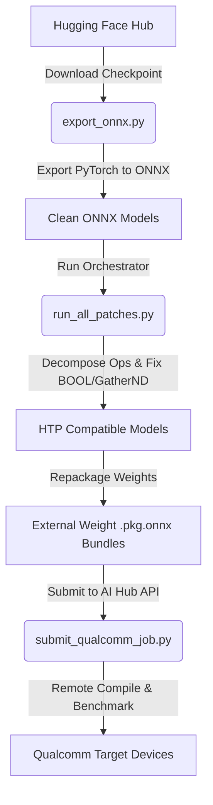

# Qualcomm AI Hub Job Submission and Optimization Scripts

This directory contains the scripts and tooling used to optimize, package, verify, and run benchmark/inference jobs for the Discrete Diffusion Speech Translation model on Qualcomm Snapdragon Neural Processing Units (NPUs) using the Qualcomm AI Hub API.

---

## Directory Structure

```
scripts/qualcomm-job/
├── patches/                  # ONNX optimizations & compatibility patches
│   ├── decompose_asinh.py    # Decomposes Asinh operator into supported primitives
│   ├── decompose_sign.py     # Decomposes Sign operator into supported primitives
│   ├── fix_bool_ops.py       # Handles QNN unsupported BOOL inputs for Pad/GatherND
│   ├── fix_gathernd_rank.py  # Reduces Rank-5 GatherND to Rank-4 Gather/Reshape
│   ├── repackage_models.py   # Packages models with external weight .data files
│   ├── run_all_patches.py    # Orchestrator to run all patches & repackaging
│   └── test_gathernd_patch.py# Local patch validation utility
├── submission/               # Qualcomm AI Hub job submission
│   ├── submit_qualcomm_job.py# Compiles & benchmarks models on target devices
│   └── test_submit.py        # Submission smoke test
├── inference/                # Verification & benchmarking scripts
│   ├── test_local_inference.py # End-to-end PyTorch vs ONNX local translation loop
│   ├── test_full_inference.py  # Iterative on-device inference via AI Hub API
│   ├── test_inference_multi_chipset.py # Multi-device concurrent benchmarking
│   └── run_benchmark.sh      # Bash script to run single-device benchmark
├── documents/                # Execution logs and reference documents
└── utils.py                  # Common utilities for audio, token, and API management
```

---

## Prerequisites & Setup

We manage Python virtual environments and dependencies using [uv](https://github.com/astral-sh/uv).

### 1. Environment Setup
Make sure you have `uv` installed, then create and activate the environment:
```bash
# Create the environment
uv venv

# Activate the environment
source .venv/bin/activate
```

Install the required dependencies if not already installed (e.g., `onnx`, `onnxruntime`, `torch`, `qai-hub`, `python-dotenv`, `librosa`):
```bash
uv pip install -r requirements.txt
```

### 2. Configure Credentials
Create a `.env` file in the root directory of the repository and add your Qualcomm AI Hub API token:
```env
QUALCOMM_TOKEN=your_qualcomm_ai_hub_api_token_here
```

The scripts will automatically load this token using `utils.setup_qualcomm_token()`.

---

## End-to-End Pipeline Overview

Here is the complete process to download the model from Hugging Face, optimize it for Qualcomm hardware, repackage it, and run on the AI Hub:



1. **Download & Export**: Load model configuration/weights from Hugging Face and export to base ONNX models using `scripts/model-manager/export_onnx.py`.
2. **Patch & Repackage**: Optimize the ONNX graphs for QNN compatibility (solving unsupported operators like `Asinh`, `Sign`, `BOOL` inputs, and Rank-5 `GatherND`) and package external weight `.data` files using `scripts/qualcomm-job/patches/run_all_patches.py`.
3. **Compile & Benchmark**: Submit the packaged models to Qualcomm AI Hub via `scripts/qualcomm-job/submission/submit_qualcomm_job.py` or run benchmark/profiling suites on selected Qualcomm chipsets.

---

## Detailed Usage Workflow

### Step 1: Download from Hugging Face & Export to ONNX
First, export the Discrete Diffusion model (backbone and Moonshine streaming audio encoder) from the Hugging Face checkpoint:

```bash
uv run python scripts/model-manager/export_onnx.py
```
This downloads model configuration and weight files from Hugging Face Hub (default: `aiai-laboratory/diffusion-speech-translation-from-vi-v1`), resolves attention mechanisms to `eager` format, and outputs base ONNX models to `onnx/audio_encoder.onnx` and `onnx/diffusion_backbone.onnx`.

---

### Step 2: Apply Compatibility Patches and Repackage
Qualcomm QNN HTP compiler has restrictions on specific operators (like `Asinh`, `Sign`, `BOOL` input types, and high-rank `GatherND`). Run the orchestrator to clean, patch, and package both the Audio Encoder and Diffusion Backbone:

```bash
uv run python scripts/qualcomm-job/patches/run_all_patches.py
```
This script:
1. Restores the models from their clean states in `onnx/`.
2. Resolves high-rank `GatherND` operators.
3. Mathematically decomposes `Asinh` and `Sign` operations.
4. Introduces `Cast` logic around `BOOL` Pad/GatherND operators.
5. Repackages the ONNX files and their external weight files (`.data`) into compliant `.pkg.onnx` bundles.

---

### Step 3: Local Verification (Optional)
Run the local inference script using PyTorch or ONNX Runtime to ensure the model outputs match expectations:

```bash
# Verify both PyTorch and ONNX local output on a sample audio file
uv run python scripts/qualcomm-job/inference/test_local_inference.py --mode both --audio test/test_data/test_sample.mp3
```

---

### Step 4: Submission & Benchmarking on Qualcomm AI Hub

#### A. Run Single-Device Benchmark
Use the helper bash script to compile and benchmark the model on a single device family (default is `Samsung Galaxy S25 (Family)`):

```bash
# Grant execution permission if necessary
chmod +x scripts/qualcomm-job/inference/run_benchmark.sh

# Run the benchmark
./scripts/qualcomm-job/inference/run_benchmark.sh
```

Alternatively, run the multi-chipset python script directly for a custom device/runtime:
```bash
uv run python scripts/qualcomm-job/inference/test_inference_multi_chipset.py \
  --runtime onnx \
  --devices "Samsung Galaxy S25 (Family)" \
  --audio test/test_data/test_sample.mp3
```

#### B. Run Multi-Chipset Benchmarking (Asynchronous)
Submit jobs concurrently to multiple target Qualcomm devices (Galaxy S23/S24/S25/S26, Snapdragon X Elite, Snapdragon 8 Elite, etc.) to benchmark execution times and performance:

```bash
uv run python scripts/qualcomm-job/inference/test_inference_multi_chipset.py
```

#### C. Perform Iterative On-Device Inference via AI Hub API
Submit step-by-step backbone inference requests to the target device through the Qualcomm AI Hub API to run the full diffusion loop:

```bash
uv run python scripts/qualcomm-job/inference/test_full_inference.py --steps 10 --runtime onnx
```

#### D. Compile & Profile Models on AI Hub
To submit custom compilation and profiling jobs to Qualcomm AI Hub manually, use the submission script:

```bash
uv run python scripts/qualcomm-job/submission/submit_qualcomm_job.py --device "Samsung Galaxy S25 (Family)" --runtime qnn
```
